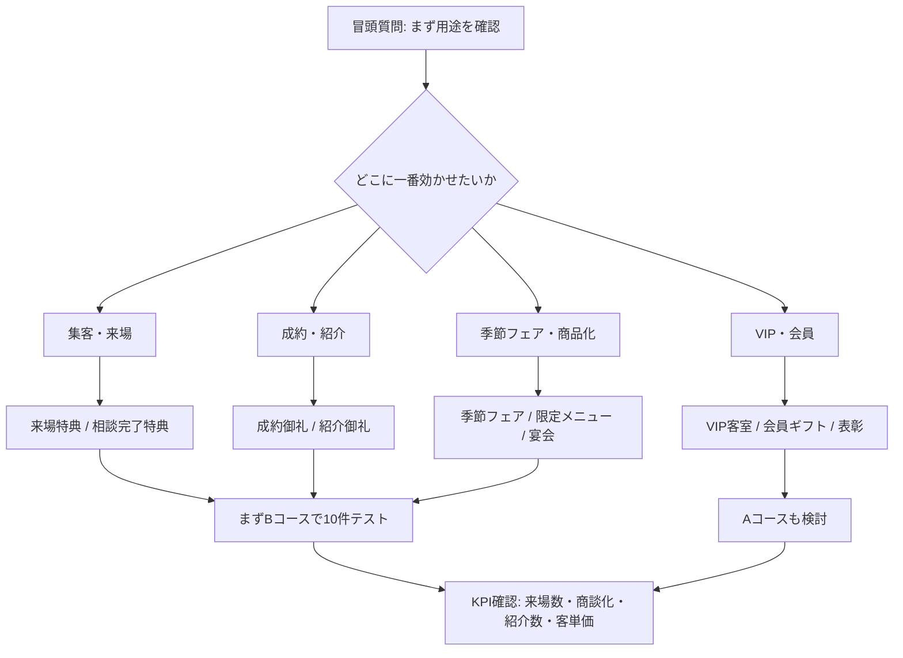

# 六業種の果物ギフト導入可能性レポート

## エグゼクティブサマリー

結論として、**優先度が高いのは「ホテル・旅館」「車ディーラー」「住宅・リフォーム」**です。いずれも高単価商材を扱い、来場・成約・紹介・VIP対応といった明確な用途があり、ギフト費用を**販促費・景品費・顧客維持費**として組みやすいからです。ホテルは訪日客数と消費額が過去最高圏で、季節演出の需要が強く、ディーラーと住宅は成約単価が高いため、年間45.5万〜78万円の施策でも回収仮説を立てやすいです。citeturn0search5turn7search0turn17search1turn19search2

**「ゴルフ場・会員制クラブ」は有望だが、運用形は“景品・会員施策”寄り**です。コンペ景品や会員向けギフト文化があり、果物との相性は高い一方、現場での保管や当日天候の影響を受けやすいため、**現地手渡しではなく“当選後直送”設計**が前提になります。citeturn4search2turn8search0turn16search1turn16search12

**「士業・保険・金融」はLTVが高く、既存顧客や紹介文脈には強いが、保険は規制が重い**ため、導入余地は業種内で差が大きいです。税理士・会計・資産運用・相続は有望ですが、保険募集に紐づく景品は特別利益規制に注意が必要です。citeturn12search5turn14view0turn15search1turn20search4

**「高級パティスリー」は、現行の“10セット×13か月のギフトサブスク”より、“季節フェア向けの小口卸・特定期間供給”の方が適合**します。市場自体は拡大していますが、規格・熟度・納期・代替品管理の要件が厳しいため、導入難易度は最も高めです。citeturn1search11turn9search0turn10search6turn10search5

前提コストは共通で、**Bコースは年45.5万円、Aコースは年78万円**です（いずれも税・送料等別、10セット×13か月想定）。この費用が自然に見えるのは、「食費」ではなく、**来場特典・成約御礼・紹介御礼・会員施策・VIP演出**として予算化できる業種です。

## 比較サマリー

| 業種 | 市場規模/追い風指標 | 予算科目 | 導入難易度 | 想定導入用途 | 優先度 |
|---|---|---|---|---|---|
| ホテル・旅館 | 2025年訪日客4,268万人、消費額9.46兆円、宿泊統計でも外国人宿泊需要が高水準。citeturn0search5turn7search0turn6search4 | 販促費、宿泊商品原価、VIP接遇費 | 中 | VIP客室、記念日プラン、宴会、売店 | 高 |
| ゴルフ場・会員制クラブ | ゴルフ人口912万人、月間利用者7百万人規模。citeturn4search2turn8search0 | 景品費、イベント費、会員サービス費 | 中 | コンペ景品、会員ギフト、来場企画 | 中 |
| 車ディーラー | 2025年新車販売456.6万台、紹介/成約インセンティブ施策が普及。citeturn2search4turn17search1turn17search8 | 販促費、景品費、CS費 | 低〜中 | 成約御礼、紹介御礼、納車ギフト | 高 |
| 住宅・リフォーム | 新設住宅着工は2025年74.1万戸へ減少、競争は激化。リフォーム市場は7.3兆円。citeturn1search0turn11search1turn19search2 | 販促費、広告宣伝費、紹介費 | 中 | 来場促進、商談進展特典、OB紹介 | 高 |
| 士業・保険・金融 | NISA利用拡大、相続税申告件数・課税価格とも増加。citeturn14view0turn12search4turn12search5 | 販促費、セミナー費、交際費 | 中〜高 | 紹介御礼、既存顧客フォロー、相続/資産形成イベント | 中 |
| 高級パティスリー | 菓子市場は2025年小売4.1兆円で過去最高、季節フルーツフェアが常態化。citeturn1search11turn9search0turn10search6 | 原材料費、販促費、催事費 | 高 | 季節フェア、限定メニュー、法人手土産 | 中〜低 |

## 業種別評価

**ホテル・旅館**  
需要の追い風が最も明確です。訪日客と旅行消費が過去最高を更新し、ホテル側は**「地域性」「季節性」「高単価客の体験価値」**を作る理由があります。用途は、①VIP客室のウェルカムフルーツ、②記念日・連泊・上位客室プラン、③宴会・ラウンジ、④館内の季節フェアが中核です。実現性は**高**で、Bコースなら月10組のVIP演出、Aコースなら上位客室・記念日プランの常設に向きます。導入ハードルは鮮度・客室設置オペレーション・ナイフ提供・廃棄管理で、**対象客室を限定し、カット果物ではなく丸物中心、当日納品、売れ残りはラウンジ転用**が現実策です。類似ケースとして、ホテル・旅館のウェルカムフルーツ付き宿泊プランや、ホテルのメロン・夏フルーツフェア、桃狩り連動宿泊プランが確認できます。営業トークは「**貴館では旬の果物を、VIP客室・記念日プラン・宴会・売店のどこで使うのが一番収益に近いでしょうか。**」がよいです。citeturn0search5turn7search0turn18search0turn18search2turn18search8

**ゴルフ場・会員制クラブ**  
市場はコロナ後の急伸から落ち着いたものの、ゴルフ人口は912万人、月間利用者も7百万人規模で、**コンペ景品・会員向け優待・季節イベント**の文化が残っています。B/Aコースの現実性は**中**で、最も相性がよいのは毎月の月例杯・オープンコンペ・法人会員施策です。ハードルは、当日保管、夏場の品質、天候による参加数変動、幹事の景品調整です。対策は、**現地渡しではなく“賞品目録→当選者宅へ直送”**、賞名別の熨斗対応、予備在庫を持たない運用です。類推事例として、ゴルフコンペ向け果物景品の専門販売や、果物の産地直送景品が定着しています。営業トークは「**御社のコンペ景品・会員特典・来場企画の中で、一番動きやすいのはどれですか。**」が最短です。citeturn4search2turn8search0turn16search1turn16search12

**車ディーラー**  
営業適合性は非常に高いです。2025年の新車販売は456.6万台で、各社が**紹介キャンペーン、成約特典、ディーラーオプション特典**を継続しており、果物ギフトを**販促費・景品費**で処理しやすい土壌があります。B/Aコースの現実性は**高**で、①成約御礼、②紹介成約御礼、③納車月キャンペーンにそのまま当て込めます。ハードルはメーカー販促ルール、景品表示法、店舗間公平性ですが、**納車完了後発送・紹介成約後発送・特定フェア限定**にすれば整理しやすいです。類似事例は、トヨタモビリティ東京、Honda Cars、BMW正規ディーラーの紹介特典、三菱のディーラーオプション特典です。営業トークは「**来店促進・成約御礼・紹介御礼のうち、どこに乗せるのが一番数字に直結しますか。**」です。citeturn2search4turn17search1turn17search3turn17search8turn17search0

**住宅・リフォーム**  
マクロは逆風です。2025年の新設住宅着工は74.1万戸まで減少し、集客競争は激化しています。他方で、リフォーム市場は7.3兆円規模が維持され、政府も既存住宅流通・リフォーム市場の活性化を進めています。つまり、**市場成長というより“集客と紹介の競争圧力”が追い風**です。B/Aコースの現実性は**高**で、来場即配布よりも、①来場予約＋次回商談、②OB顧客紹介、③リフォーム成約御礼に向きます。ハードルは検討期間が長いこと、展示場間での不公平感、失注率ですが、**「初回来場」ではなく「商談進展」「紹介成立」「成約後」条件に寄せる**のが有効です。類似ケースとして、大和ハウスの来場・次回商談特典や、リフォーム会社の紹介キャンペーンが確認できます。営業トークは「**来場集客、次回商談化、OB紹介のどこに置くと最も回収しやすいでしょうか。**」が適しています。citeturn1search0turn11search1turn1search5turn19search2turn19search1turn19search12

**士業・保険・金融**  
相続税の申告件数・課税価格は増加し、NISAも利用拡大が続いており、**相続・税務・資産形成・保全**の相談需要は強いです。したがって、税理士・会計・FP・IFA・相続支援では、**紹介御礼、既存顧客の季節フォロー、セミナー後送付**に使いやすい一方、保険は特別利益規制があるため、**契約誘引に直接結びつく設計は避けるべき**です。Bコースは有望、Aコースは富裕層向けや相続案件に限定が妥当です。ハードルはコンプライアンス、個人情報、保険業法で、対策は**保険では“成約特典”ではなく既契約者フォロー・季節挨拶・イベント来場後ギフト”に寄せる**ことです。類似ケースは、会計事務所の紹介プログラム、顧客紹介キャンペーン、士業向けイベントギフト、保険会社の紹介キャンペーンです。営業トークは「**新規紹介、既存顧客フォロー、セミナー来場後の御礼のどれが一番運用しやすいですか。**」です。citeturn12search5turn12search4turn15search1turn20search4turn20search8turn20search3turn12search10

**高級パティスリー**  
市場自体は堅調で、菓子小売は2025年に4.1兆円で過去最高、季節果実フェアも各店で活発です。ただし、現行商品形状との適合は**中〜低**です。ギフトとして店頭法人需要に転用するならありですが、原材料供給として回すなら、**規格、糖度、熟度、納期、代替品ルール**が必須で、10セット×13か月の固定サブスクより**旬ごとのスポット契約**が向きます。ハードルは最も高く、対策は**テスト導入を2〜3か月のシーズン限定にし、品目ごとに代替基準を事前合意**することです。類似ケースとして、ラ・メゾンやカタシマ、ARROW TREEなどが旬フルーツのタルト・フェアを継続展開しています。営業トークは「**御社では旬果物を、限定メニュー・催事・法人手土産のどこに置くと粗利を作りやすいですか。**」です。citeturn1search11turn9search0turn10search6turn10search3turn10search5

## 商談分岐の共通設計

下の分岐は、六業種すべてに使えます。最初に**用途を聞く**ことで、価格の話に入る前に予算科目と決裁者を特定しやすくなります。



実務上の決裁フローは、**現場責任者→販促/商品企画→経理**が基本です。ホテルは支配人・宿泊責任者、ゴルフは支配人・競技/営業、ディーラーは店長・販促責任者、住宅は営業所長・マーケ、士業/金融は代表・コンプラ、高級パティスリーはオーナー・シェフ・MDが主な関門になります。保険だけは**募集規制チェックが必須**です。citeturn15search1turn12search2

## 主要出典URL

```text
ホテル・旅館
https://www.jnto.go.jp/news/press/20260121_monthly.html
https://www.mlit.go.jp/kankocho/news02_00071.html
https://www.asaya-hotel.co.jp/news/233/
https://www.itoyanagi-yuwa.com/news/110/

ゴルフ場・会員制クラブ
https://www.ssf.or.jp/thinktank/sports_life/data/golf.html
https://www.golf-ngk.or.jp/news/
https://556.jp/SHOP/golfkudamono33.html
https://www.get-club.net/keihin/list.html?product_category=325&srsltid=AfmBOoo-mcwMppYT3ODa_W8J61xRxhw6-puhX7IrYooVamSOV_AK

車ディーラー
https://www.marklines.com/ja/statistics/flash_sales/automotive-sales-in-japan-by-month-2025
https://www.toyota-mobi-tokyo.co.jp/cp/introduction
https://osaka.bmw.jp/ja/bmw_ftof
https://dealer.honda.co.jp/hondacars-tsu/news/detail/?news_id=3978

住宅・リフォーム
https://www.mlit.go.jp/report/press/joho04_hh_001350.html
https://www.yano.co.jp/press-release/show/press_id/3877
https://www.daiwahouse.co.jp/jutaku/fair/2026spring/
https://kurasuhome.co.jp/specialcampaigns

士業・保険・金融
https://www.nta.go.jp/information/release/kokuzeicho/2025/sozoku_shinkoku/index.htm
https://www.fsa.go.jp/policy/nisa/20250924.html
https://www.fsa.go.jp/common/law/guide/ins/02d.html
https://ur-cloud.jp/column/cG9zdDoyODEx

高級パティスリー
https://anka-kashi.com/statistics.html
https://www.yano.co.jp/press-release/show/press_id/3781
https://www.la-maison.jp/news/003452.html
https://arrow-tree.com/
```